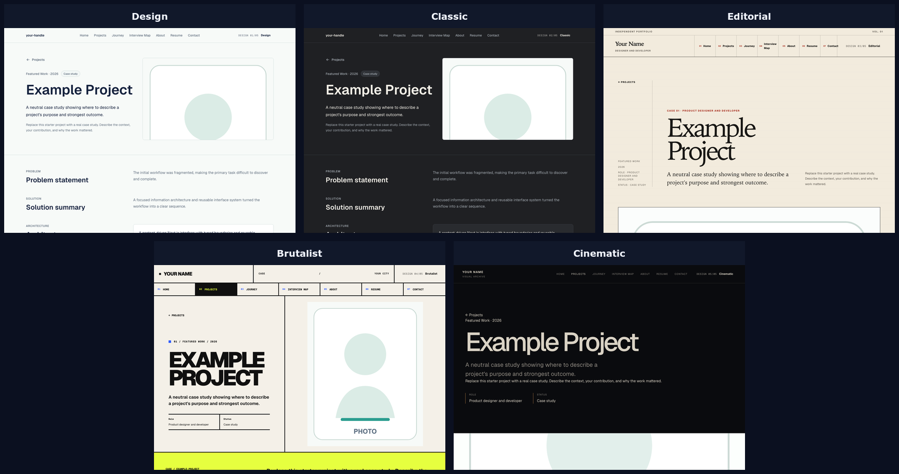
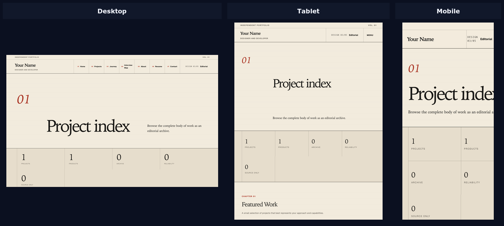

# Portfolio Site


`portfolio-site`는 42 과정의 포트폴리오 과제를 변형한 Next.js App Router 프로젝트입니다. 하나의 profile·project·contact 콘텐츠를 다섯 가지 시각 체계로 표현합니다. `src/content`의 JSON을 런타임에 검증하고 route별 view model로 변환한 뒤 Design, Classic, Editorial, Brutalist, Cinematic renderer가 공유합니다.

디자인 시안만 모은 프로젝트가 아닙니다. 콘텐츠 원본과 화면 표현을 분리하고, server rendering과 hydration, 반응형 레이아웃, 접근성, 검색 노출, 정적 자산과 production readiness를 자동 검사합니다.



## 한눈에 보기

| 항목 | 내용 |
| --- | --- |
| framework | Next.js App Router |
| UI | React |
| 콘텐츠 원본 | `src/content`의 JSON |
| 콘텐츠 처리 | 런타임 검증 → route별 view model → renderer |
| 표현 방식 | Design, Classic, Editorial, Brutalist, Cinematic |
| 배포 산출물 | Next.js standalone server |
| 주요 검증 | lint, typecheck, content readiness, unit, E2E, container, bundle, Lighthouse |

## 실행 환경

| 도구 | 버전 |
| --- | --- |
| Node.js | `24.18.0` |
| npm | `11.16.0` |
| Next.js | `16.2.11` |
| React | `19.2.4` |

버전은 `.node-version`, `.nvmrc`, `package.json`, Dockerfile과 CI에서 함께 고정합니다.

## 빠른 시작

```sh
npm ci
npm run dev
```

개발 서버는 `http://localhost:3100`에서 실행됩니다.

표현 방식을 query로 바꿀 수 있습니다.

```text
?view=design
?view=classic
?view=editorial
?view=brutalist
?view=cinematic
```

기본값은 `editorial`이며 URL에서는 `view`를 생략합니다. 콘텐츠 문구의 JSON 위치를 화면에서 확인하려면 다음 query를 사용합니다.

```text
?debug=content
```

## 지원 route

```text
/
/projects
/projects/[projectId]
/about
/resume
/contact
/journey
/interview-map
```

page 활성 상태와 project ID가 콘텐츠와 맞지 않으면 `notFound()`가 처리합니다. root layout은 local font, 전역 stylesheet와 기본 metadata를 연결합니다.

`favicon.ico`, `robots.ts`, `sitemap.ts`는 Next.js file-based metadata 진입점입니다.

## 콘텐츠에서 화면까지

```text
src/content/*.json
  -> schema와 교차 참조 검증
  -> template/production readiness 검사
  -> route별 loader
  -> 공통 view model
  -> 선택한 renderer
  -> server-rendered HTML
  -> 필요한 client component hydration
```

다섯 renderer는 콘텐츠 파일을 직접 제각각 해석하지 않습니다. 공통 view model을 받아 같은 정보 구조를 서로 다른 시각 언어로 표현합니다.

이 분리를 통해 다음 문제를 줄입니다.

- 디자인마다 project 정렬과 활성 상태가 달라지는 문제
- 링크·자산·contact 값 검증이 renderer마다 중복되는 문제
- 콘텐츠 필드가 추가될 때 일부 화면만 조용히 누락되는 문제
- server와 client가 서로 다른 원본을 읽어 hydration 결과가 달라지는 문제

## 다섯 표현 방식

| renderer | 방향 |
| --- | --- |
| Design | 구성 요소와 시각 효과를 적극적으로 사용하는 제품형 표현 |
| Classic | 전통적인 이력서·포트폴리오 정보 배치 |
| Editorial | 넓은 여백과 타이포그래피 중심의 기본 표현 |
| Brutalist | 노출된 grid, 강한 선과 직접적인 상호작용 |
| Cinematic | 큰 시각 요소와 장면 전환에 가까운 표현 |

다섯 표현은 우열을 판정하기 위한 A/B 실험 결과가 아닙니다. 같은 콘텐츠·route·접근성 조건을 서로 다른 renderer가 어떻게 유지하는지 확인하는 구현입니다.



## 콘텐츠 mode

### Template

기본 mode는 예제 값을 허용하고 검색 비색인 정책을 사용합니다.

```sh
npm run content:check
npm run build
npm run start
```

`npm run build`는 `prebuild`에서 콘텐츠 형식과 readiness를 검사한 뒤 `next build --webpack`을 실행합니다.

### Production

공개 후보는 실제로 제어하는 origin과 production mode를 명시해야 합니다.

```sh
export PORTFOLIO_CONTENT_MODE=production
export SITE_URL="https://your-controlled-public-origin.example"
npm run build
```

위 URL은 예시입니다. 실제 값으로 바꾸지 않으면 readiness 검사에서 거부됩니다.

production mode는 다음 항목을 확인합니다.

- placeholder 문구가 남아 있지 않은지
- profile과 social image가 준비되었는지
- resume 자산이 존재하는지
- 활성 project의 공개 link와 자산이 유효한지
- contact 방법이 실제 값인지
- `/content/` 공개 자산이 추적되어 있는지
- `SITE_URL`이 허용한 공개 origin인지

`PORTFOLIO_CONTENT_MODE`와 `SITE_URL`은 server 전용 값입니다. secret을 `NEXT_PUBLIC_*` 이름으로 두면 브라우저 bundle에 포함될 수 있으므로 사용하지 않습니다.

## 정적 자산

```text
public/template/   # 예제 콘텐츠가 가리키는 자산
public/content/    # 실제 공개 콘텐츠 자산
```

Docker runner는 `public/`을 명시적으로 복사합니다. container 검사는 실제 route와 Git에 추적된 자산이 standalone 환경에서도 응답하는지 확인합니다.

외부 image host를 기본 계약으로 두지 않으며 콘텐츠와 함께 관리하는 정적 자산을 기준으로 합니다.

## server rendering과 hydration

가능한 콘텐츠 해석과 route 구성은 server에서 수행합니다. 상호작용이 필요한 작은 범위만 client component로 분리합니다.

- server는 검증된 콘텐츠와 선택한 renderer로 초기 HTML을 만듭니다.
- client는 navigation, filter, animation처럼 브라우저 상태가 필요한 부분만 hydrate합니다.
- renderer 선택 query와 server 기본값이 달라지지 않도록 한 곳에서 정규화합니다.
- client 전용 API를 server render 중 호출하지 않습니다.

상세한 요청 수명을 다루는 별도 문서는 아직 없습니다. 위 규칙이 현재까지의 요청·server rendering·hydration 범위 전체입니다.

## 검색 노출과 machine-readable output

- root metadata와 route별 metadata를 생성합니다.
- `robots.ts`가 template과 production mode의 색인 정책을 구분합니다.
- `sitemap.ts`가 활성 route와 project를 기준으로 URL을 만듭니다.
- `SITE_URL`을 기준으로 canonical URL을 계산합니다.
- template mode는 예제 콘텐츠가 검색 결과에 노출되지 않도록 비색인을 기본으로 합니다.

readiness 검사는 형식과 marker를 확인할 뿐 경력·성과 문구의 사실성을 판정하지 않습니다. 공개 전 내용 검토는 작성자의 책임입니다.

## 검증

```sh
npm run lint
npm run typecheck
npm run content:check
npm run test
npm run test:e2e:production
npm run build:verify
npm run test:container
npm run bundle:check
npm run lighthouse:audit
```

| 명령 | 확인하는 내용 |
| --- | --- |
| `lint` | source와 설정의 정적 규칙 |
| `typecheck` | TypeScript 타입 검사 |
| `content:check` | JSON schema, 참조와 자산 경로 |
| `test` | 콘텐츠 변환과 UI 단위 회귀 |
| `test:e2e:production` | production Next build/server를 대상으로 한 browser 흐름 |
| `build:verify` | standalone 산출물과 필수 파일 |
| `test:container` | Docker image의 route와 정적 자산 응답 |
| `bundle:check` | client bundle 기준값 회귀 |
| `lighthouse:audit` | 통제된 desktop Lighthouse 품질 기준 |

`test:e2e:production`의 `production`은 Next production server를 뜻하며 `PORTFOLIO_CONTENT_MODE=production`을 자동 설정한다는 뜻은 아닙니다.

Lighthouse와 bundle 기준값은 저장된 과거 측정입니다. 현재 checkout을 변경했다면 명령을 다시 실행하고 실제 결과를 기록해야 합니다.

## 정리

```sh
make clean  # .next, coverage, playwright-report 등 빌드·테스트 산출물 삭제
make fclean # clean과 동일한 산출물 삭제 후 node_modules 제거
make re     # fclean 후 npm ci와 build 재실행
```

빌드 산출물과 테스트 캐시는 저장소에 포함하지 않습니다.

## 문서

- [첫 Production 배포 가이드](docs/FIRST-PRODUCTION-DEPLOYMENT-GUIDE.md)

## 제한 사항

- CMS, database와 사용자별 server 상태가 없습니다.
- 인증과 관리자 편집 화면을 제공하지 않습니다.
- analytics와 실제 방문자 성능 수집을 포함하지 않습니다.
- 특정 hosting provider, reverse proxy와 TLS 설정을 포함하지 않습니다.
- Playwright와 axe가 모든 browser·screen reader 조합을 증명하지는 않습니다.
- Lighthouse는 통제된 실험실 측정이며 실제 사용자 성능을 대신하지 않습니다.
- 다섯 디자인의 미적 우열을 자동으로 판정하지 않습니다.

## 프로젝트 배경

이 저장소는 42 과정의 포트폴리오 프로젝트를 콘텐츠 기반 웹 애플리케이션으로 확장한 결과입니다. 한 번 작성한 콘텐츠를 다섯 renderer가 공유하도록 재설계하고, template·production mode, runtime 검증, standalone container, 접근성·bundle·Lighthouse 회귀 검사를 추가했습니다.
